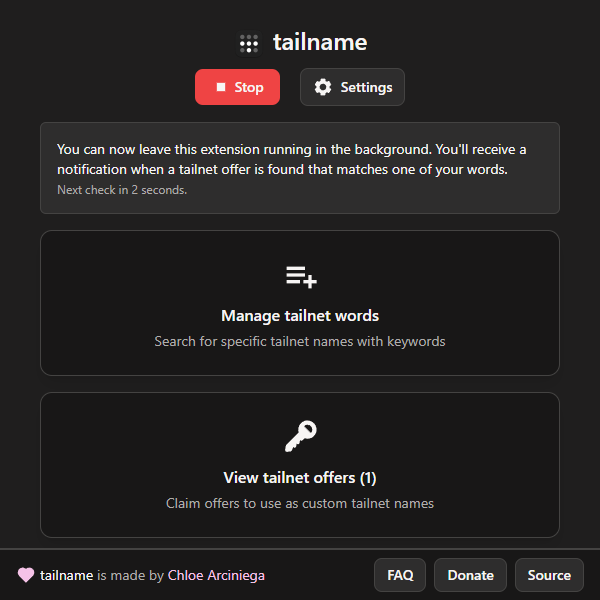
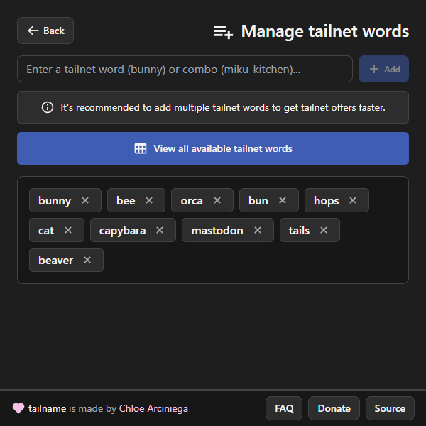
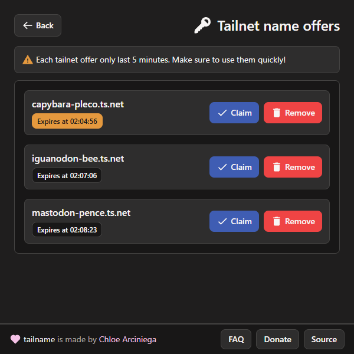

#  tailname

 

A browser extension that finds custom tailnet name offers for your Tailscale account using keywords.

  
  
  

## How to install
### Chromium-based browsers (Google Chrome, Microsoft Edge, etc)
*We plan on submitting this extension to the Chrome Web Store soon.*

In the meantime, use the following instructions to sideload the extension:

0. Get the [latest release for Chromium](link).
1. Extract the ZIP archive using an archival program of your choice.
2. Navigate to the Extensions page using [chrome://extensions](chrome://extensions).
3. Click the "Load unpacked" button.
4. Select the extracted folder of the extension.
5. Done!

### Gecko-based browsers (Firefox, Zen Browser, etc)
*The extension submission is currently awaiting a review on the Mozilla Add-on Developer Hub.*

In the meantime, use the following instructions to sideload the extension:

0. Get the [latest release for Firefox](link).
1. Navigate to the Extensions page using [about:addons](about:addons).
2. Click on the settings icon, and select "Install Add-ons From File...".
3. Select the ZIP archive of the extension.
4. Done!

## License

This repository is licensed under the [zlib](LICENSE) license.

This extension is not affiliated with Tailscale, Inc.

© 2025 Sapphic Angels.